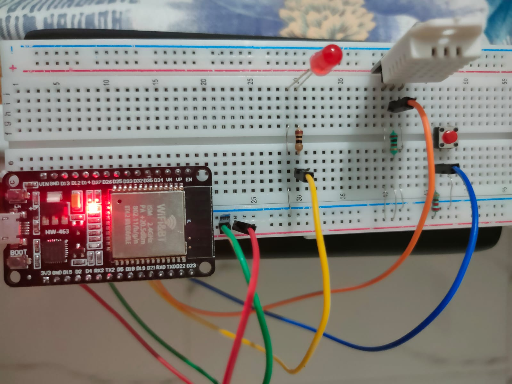

# Micropython Based Project for ESP32



### Description of Project
- This project enables ESP32 device to first create its own wifi access point names "ESP32-Server" with password set to "password".
- Then user can open IP Address 192.168.4.1 which will present user with web page.
- User can then set up his own Wifi Network credentials and MQTT credentials using web app.
- Once the setup is complete user can restart the device which will bring it to MQTT mode and will then publish DHT22 sensor data to MQTT Broker.
- User can click on Push button 3 times within 5 seconds to reset Device. 

Will soon upload pin diagram

### Components Used:
ESP32 Board Devkit v1
DHT22 Temprature and Humidity Sensor
Led
Push Button
2 K and 5k Ohm resistors
Jumper Wires
Bread Board
Power Bank and Usb cable to power up

### Future
- In its current state this projects aims to interface with various environmental sensors to and publish data over local MQTT broker, which then can publish to AWS IOT etc.
- Also this project can be modified to be used as a entry-point for creating a home automation device using MQTT Broker or Web App. 

### Credits
[MicroWebSrv](https://github.com/jczic/MicroWebSrv) is used for serving web requests.
[RuiSantosdotme ESP-MicroPython MQTT](https://raw.githubusercontent.com/RuiSantosdotme/ESP-MicroPython/master/code/MQTT/umqttsimple.py) package is used for publishing data to MQTT Broker.


### How to Flash your new ESP32 Device with Micropython
- Download [Thonny](https://thonny.org/) and install it.
- Once Thonny is installed download latest [Micropython Firmware](https://micropython.org/download/esp32/)
- Connect your ESP32 board to your computer.
- Open Thonny IDE. Go to Tools > Options > Interpreter.
- Select the interpreter as (Micropython) ESP32 and select the COM port your board is connected to. Finally, click on the link Install or update firmware. 
- If you are not able to see anything the COM Port dropdown this means you dont have drivers installed in your computer. You need to install USB to UART Bridge driver for your machine.
- Select the port once again, and then click on the Browse button to open the .bin file with the firmware you’ve downloaded on the previous step. Finally click on Install.
- For more detailed instruction follow this artical from [randomnerdtutorials.com](https://randomnerdtutorials.com/getting-started-thonny-micropython-python-ide-esp32-esp8266/)

### How to setup your own MQTT broker on Ubuntu/Debian

```bash
# To update repository
sudo apt get update
```

```bash
# To install MQTT Broker
sudo apt install mosquitto mosquitto-clients
```

```bash
# To create a user name "esp" , it will ask for password in prompt
sudo mosquitto_passwd -c /etc/mosquitto/passwd esp
```


```bash
# To change MQTT default config so that only authenticated clients can connect
sudo nano /etc/mosquitto/conf.d/default.conf

# Above command will open nano editior, copy following lines and save it.
listener 1883
allow_anonymous false
password_file /etc/mosquitto/passwd
```


```bash
# Restart MQTT Broker
sudo systemctl restart mosquitto
```

```bash
# To test , in one window run this command which will  subcribe for topic name "test-topic"
mosquitto_sub -h localhost -u esp -P password -t test-topic

# In another window open, run following command to publish message 
mosquitto_pub -h localhost -u esp -P password  -t test-topic -m "hello world"
```
